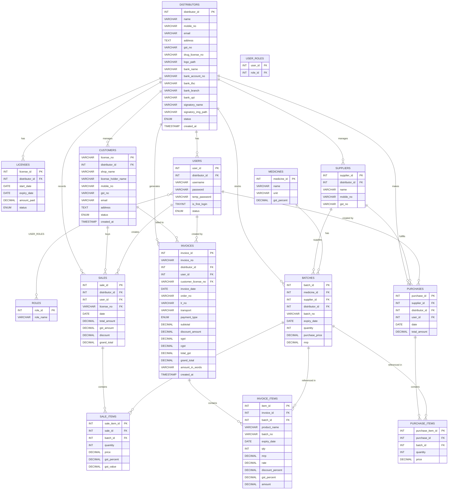
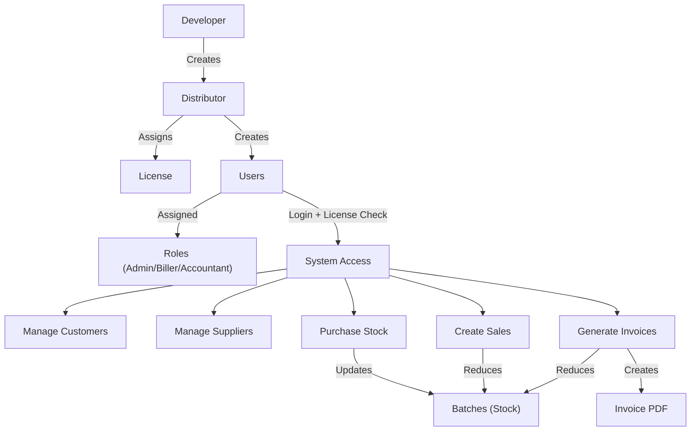

# PharmIQ — Entity Relationship Diagram

## ER Diagram

---

## Relationship Summary

| Relationship | Type | Description |
|---|---|---|
| Distributors → Users | 1:M | Each distributor has multiple users |
| Distributors → Licenses | 1:M | Subscription licenses per distributor |
| Distributors → Customers | 1:M | Each distributor manages their own customers |
| Distributors → Suppliers | 1:M | Suppliers are scoped per distributor |
| Users ↔ Roles | M:N | Via `user_roles` junction table (Admin, Biller, Accountant) |
| Medicines → Batches | 1:M | One medicine can have many batches |
| Suppliers → Batches | 1:M | Each batch sourced from one supplier |
| Distributors → Batches | 1:M | Stock is isolated per distributor |
| Purchases → Purchase Items | 1:M | Each purchase has line items |
| Sales → Sale Items | 1:M | Each sale has line items |
| Invoices → Invoice Items | 1:M | Each invoice has product line items |
| Customers → Sales/Invoices | 1:M | Customer appears on sales and invoices |

## System Flow

